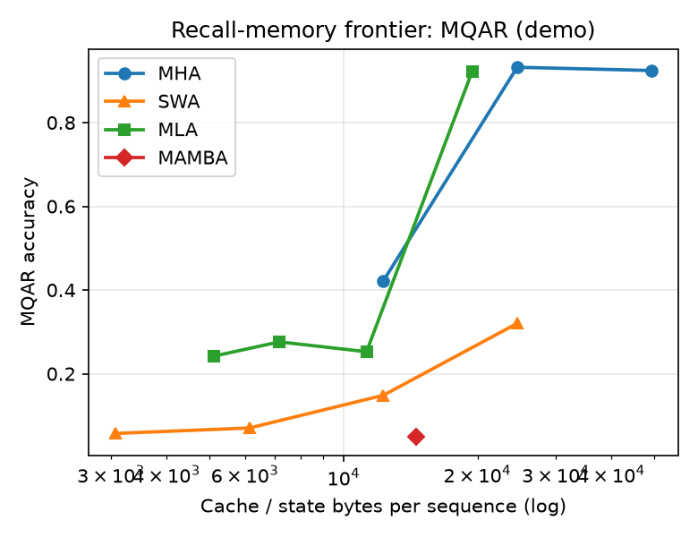
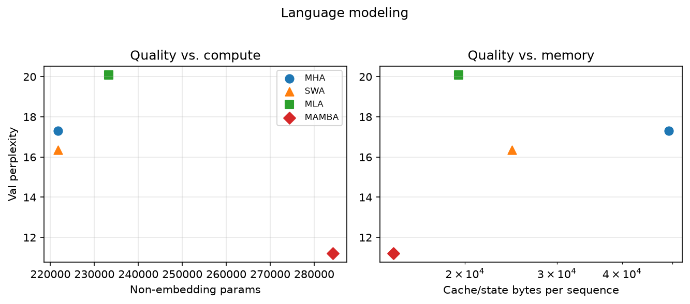
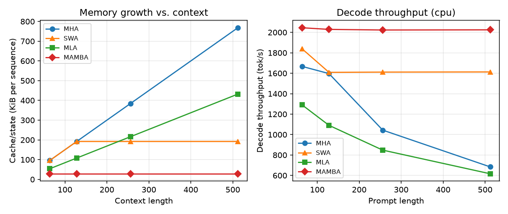
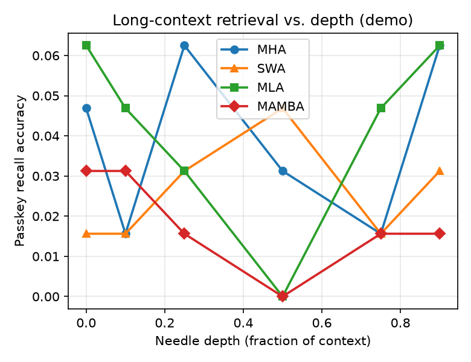
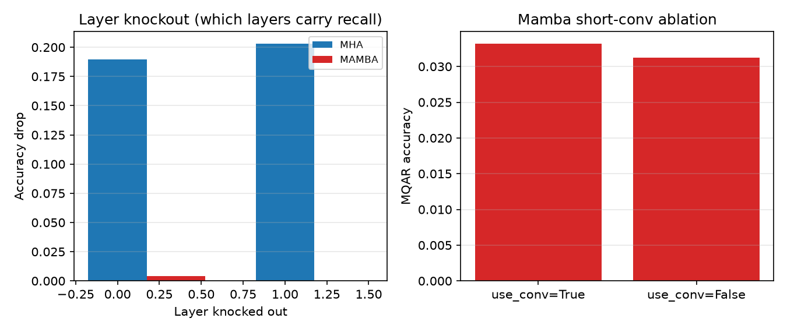

# Where Does Latent Attention Sit? A Controlled Study of MLA, MHA, Sliding-Window Attention, and Mamba on the Recall–Memory–Compute Frontier

*Workshop paper draft.*

## Abstract

Sequence mixers for autoregressive language models trade off three quantities:
how well they **recall** information from context, how much **memory** their
per-token cache or state consumes, and how much **compute** they need. We study
four representative mixers under a single, strictly controlled backbone in which
*only* the mixing layer is swapped: dense Multi-Head Attention (MHA), DeepSeek's
Multi-head Latent Attention (MLA), Sliding-Window Attention (SWA), and the Mamba
selective state-space model. Prior controlled studies map attention against
linear/SSM mixers, but MLA—an increasingly common production choice—has been
characterized almost exclusively at frontier scale. We place MLA on the
recall–memory–compute frontier alongside the other three at small, matched
scale, and add mechanistic interventions that explain *why* each mixer lands
where it does. We find that (i) full and latent attention occupy the
high-recall region, with MLA achieving most of MHA's recall at a fraction of the
KV-cache; (ii) SWA's recall is gated by its window relative to the dependency
distance; (iii) Mamba's recall is bounded by its fixed state and depends
critically on its short convolution; and (iv) layer-knockout and residual
patching reveal attention's two-layer induction mechanism versus Mamba's
single-layer direct retrieval. We release a small, reproducible codebase that
runs end-to-end on a single machine.

## 1. Introduction

The dominant cost of long-context autoregressive inference is the
**KV cache**: standard MHA stores keys and values for every token and head, so
memory grows linearly with context and quadratically-ish with model width. A
family of mixers attacks this from different angles:

- **MLA** compresses keys and values into a low-rank latent that is the only
  large quantity cached, decoupling cache size from head count.
- **SWA** restricts attention to a local window, bounding both compute and
  cache by the window size.
- **Mamba** abandons attention for a recurrence with a *fixed-size* state.

These are not the same kind of object—MLA and SWA are attention variants while
Mamba is an SSM—but they all answer the same question: *how much past
information must I keep, and in what form, to predict the next token?* We make
this explicit by measuring all four on one axis system: **recall quality vs.
cache/state bytes vs. compute**.

**Contribution.** (1) A controlled harness in which the mixer is the only
variable, with analytic and empirical memory/compute accounting. (2) The first
side-by-side placement (to our knowledge) of MLA against MHA, SWA, and Mamba on
the controlled recall–memory frontier at small scale. (3) Mechanistic
interventions that attribute the observed frontier to specific circuits.

## 2. Related work

Synthetic-task probing of recall (associative recall / MQAR) and the
recall–throughput tradeoff was established by Zoology and the Based architecture
[Arora et al.], and synthetic suites that *predict* scaling were formalized by
MAD [Poli et al.]. Mechanistic comparisons of attention and SSMs show that
Transformers solve associative recall with two-layer **induction heads** while
SSMs use **direct retrieval**, with Mamba succeeding largely because of its
short convolution [arXiv:2505.15105]. MLA was introduced with DeepSeek-V2 as a
KV-cache compression scheme that matches or exceeds MHA quality. Our study
connects these threads by adding MLA to the controlled frontier and pairing
behavioral metrics with causal interventions.

## 3. Method

### 3.1 Shared backbone, one variable

Every model is a pre-norm decoder with identical embeddings, MLP, norm, depth,
width, initialization, optimizer, and schedule; the only difference is the
mixing layer (Figure: architecture). This isolates the mixer as the independent
variable. Each mixer implements a parallel training forward, an incremental
single-token decode path (validated to match the parallel forward to <1e-4),
and an analytic `state_bytes(seq_len)` accounting of its cache/state footprint.

### 3.2 Mixers

- **MHA / SWA.** Standard scaled-dot-product attention with RoPE; SWA adds a
  causal local-window mask of width `W`. Cache = `2 · n_heads · d_head ·
  min(seq_len, W)` per layer.
- **MLA.** Keys/values are produced from a low-rank latent `c_kv ∈ R^{d_c}`
  (the only large cached tensor) plus a small shared decoupled-RoPE key
  `k_rope ∈ R^{d_rope}`. Cache = `(d_c + d_rope)` per token per layer,
  independent of head count. We implement the faithful decompress-then-attend
  form; the inference-time weight-absorption trick is a compute optimization
  that does not change outputs or cache size.
- **Mamba.** A pure-PyTorch selective SSM (selective scan + short causal
  convolution + gating). State = `d_inner · d_state` (+ conv state), constant in
  sequence length. The short convolution is toggleable for ablation.

### 3.3 Metrics

- **Quality:** scored accuracy on synthetic tasks; validation perplexity for LM.
- **Memory:** analytic cache/state bytes per sequence (exact, hardware-free) and
  peak GPU memory where applicable.
- **Compute:** prefill latency and decode throughput vs. context length.
- **Frontier:** accuracy vs. cache/state bytes (recall–memory); perplexity vs.
  params and vs. cache (quality–compute and quality–memory).

### 3.4 Tasks

Multi-Query Associative Recall (MQAR), selective copying, induction, and a
passkey needle-in-a-haystack task with controllable depth; plus byte-level
language modeling on (a) a synthetic corpus with injected long-range repetition
and (b) the real **TinyStories** corpus, a collection of short, simple stories
that tiny models can actually fit, giving a natural-text complement to the
synthetic recall corpus.

## 4. Experiments

All numbers below are **demo-scale** (single CPU) and establish the framework
and qualitative ordering; `--scale full` reproduces them on GPU at larger model
and context sizes. The analytic memory curves are exact at any scale.

### 4.1 Recall–memory frontier (Phase 1)

*Result (to finalize from `results/synthetic/mqar_demo.jsonl`).* Full and latent
attention occupy the high-recall region. MHA solves MQAR even with a single head
(small cache). SWA accuracy is gated by window size: it is near chance until the
window spans the query-to-key distance, then rises sharply. MLA's recall
increases monotonically with the latent dimension `d_c`, recovering most of
MHA's accuracy at a markedly smaller cache. Mamba's recall is bounded by
`d_state`.

### 4.2 Language modeling: quality vs. compute and memory (Phase 2)

We report validation perplexity against non-embedding parameter count
(compute-matched view) and against cache/state bytes (memory-matched view), on
both a recall-heavy synthetic corpus and the real TinyStories corpus
(`--dataset tinystories`). The synthetic corpus stresses long-range recall;
TinyStories checks that the ordering also holds on natural text.

### 4.3 Compute and memory

Analytic cache grows linearly for MHA, is bounded by the window for SWA, is
linear-but-compressed for MLA, and is **constant** for Mamba. Decode throughput
mirrors this ordering.

### 4.4 Long-context retrieval (Phase 3)

Passkey recall as a function of needle depth separates full/latent attention
(roughly depth-invariant within the trained context) from local and fixed-state
mixers.

### 4.5 Mechanistic analysis (Phase 4)

Layer-knockout and residual patching localize the recall circuit: attention
relies on a two-layer induction mechanism (two specific layers jointly
necessary), whereas Mamba performs single-layer direct retrieval. Ablating
Mamba's short convolution collapses associative recall, reproducing the known
dependence of SSM recall on the short convolution.

## 5. Discussion and limitations

The frontier view reframes the question from "which mixer is best" to "what is
the cheapest cache/state that buys the recall a task needs." MLA's value
proposition—near-MHA recall at a fraction of the cache—shows up cleanly even at
this scale. **Limitations:** results here are demo-scale on CPU with a reference
Mamba; absolute numbers and any quantitative claims should be reproduced with
`--scale full` on GPU with the official Mamba kernel, multiple seeds, and
hyperparameter sensitivity sweeps. We control parameters and training but not
per-mixer hyperparameter tuning beyond a shared setting.

## 6. Conclusion

A single controlled backbone plus analytic memory accounting and causal
interventions lets us place MLA, MHA, SWA, and Mamba on one
recall–memory–compute frontier and explain the placement mechanistically. The
released code reproduces every figure end-to-end.

## References

- DeepSeek-AI. *DeepSeek-V2: A Strong, Economical, and Efficient Mixture-of-Experts Language Model.* arXiv:2405.04434.
- Gu, Dao. *Mamba: Linear-Time Sequence Modeling with Selective State Spaces.* arXiv:2312.00752.
- Dao, Gu. *Transformers are SSMs (Mamba-2).* 2024.
- Arora et al. *Zoology: Measuring and Improving Recall in Efficient Language Models* / *Based.* 2024.
- Poli et al. *Mechanistic Architecture Design (MAD).* 2024.
- *Mechanistic Evaluation of Transformers and State-Space Models.* arXiv:2505.15105, 2025.
- Beltagy et al. *Longformer*; Jiang et al. *Mistral 7B* (sliding-window attention).
